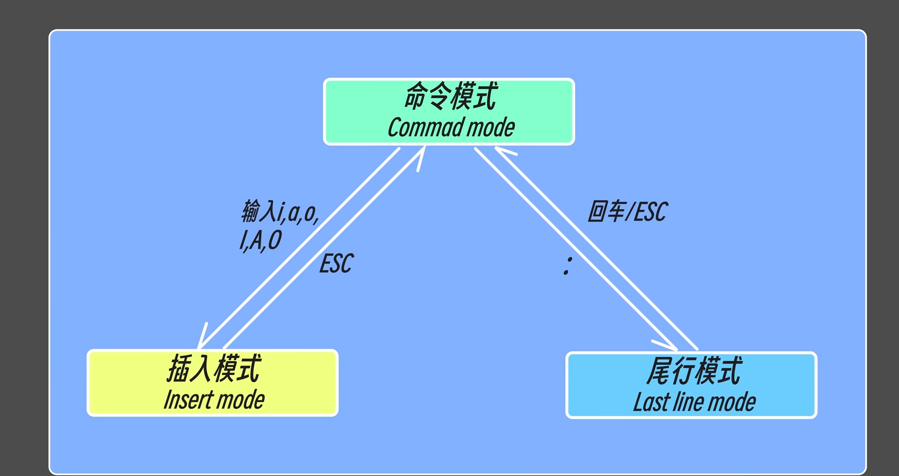
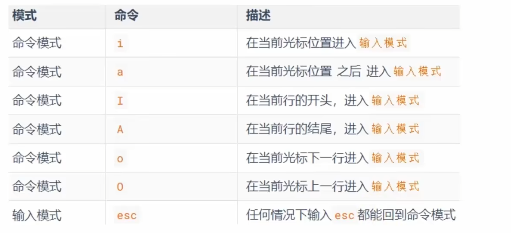
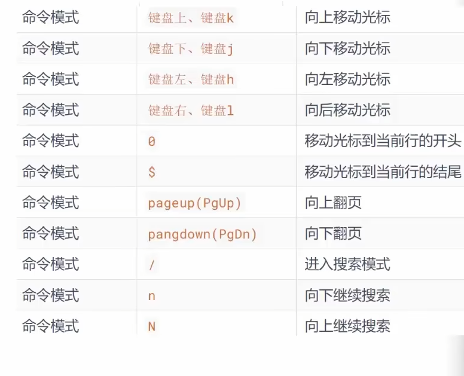
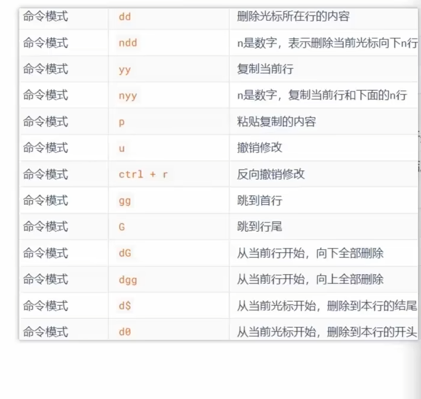
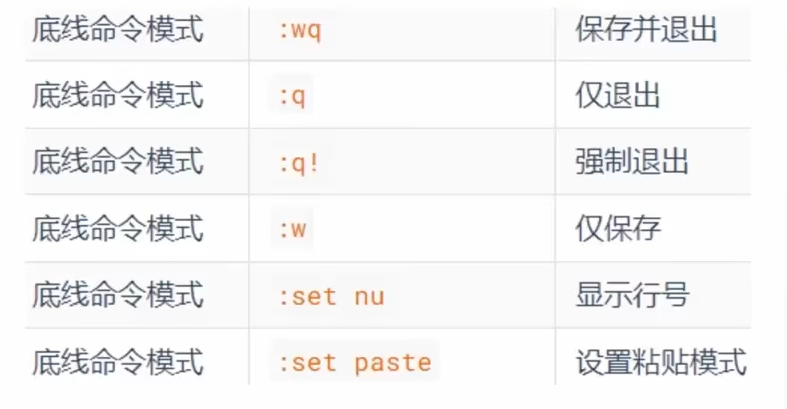

# Linux基础

`clear`清空屏幕

`vi`文本编辑器的使用

### 常用命令

命令模式下输入 i, a, o 进入插入模式。插入模式下按esc退出插入模式。

`vi` + 文件名 (可以进入文件，并进行编辑)

`ls` 命令可以查看当前目录下的文件

`cat`+ 文件名 (查看文件的内容)

`yy` 复制内容

`p` 粘贴内容

`dd` 删除内容

`: set number` 显示行号

`: set nonumber` 不显示行号

`ctrl`+`f` 向前翻页

`ctrl`+`b`向后翻页

`ctrl`+`d`向下翻一半

`ctrl`+`u`向上翻一半

