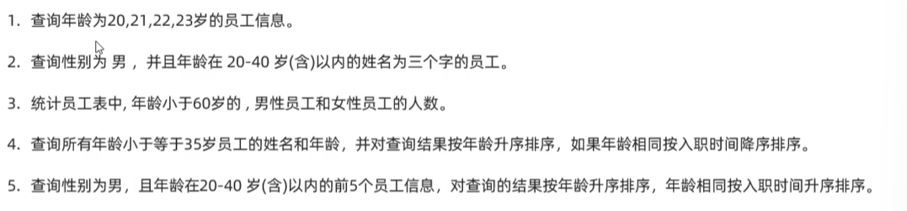

# 练习



建表语句：
CREATE TABLE `emp` (
  `id` int(10) unsigned NOT NULL AUTO_INCREMENT COMMENT '员工编号',
  `job_number` varchar(10) DEFAULT NULL COMMENT '工号',
  `name` varchar(10) DEFAULT NULL COMMENT '姓名',
  `gender` char(1) DEFAULT NULL COMMENT '性别',
  `age` tinyint(3) unsigned DEFAULT NULL COMMENT '年龄',
  `id_card` char(18) DEFAULT NULL COMMENT '身份证号',
  `hire_date` date DEFAULT NULL COMMENT '入职时间',
  `username` varchar(30) DEFAULT NULL COMMENT '用户名',
  PRIMARY KEY (`id`)
) ENGINE=InnoDB AUTO_INCREMENT=21 DEFAULT CHARSET=utf8mb4 COMMENT='员工信息表'

```sql
-- 1. 查询年龄为20，21，22，23的员工信息
select * from emp where age in (20,21,22,23);
select * from emp where age between 20 and 23;
-- 2. 查询性别为男，年龄在20-40以内的姓名为三个字的员工
select * from emp where gender = '男' and age between 20 and 40 and name like '___';
-- 3. 统计员工表中，年龄小于60岁的，男性员工和女性员工的人数
select gender, count(*) as number from emp where age < 60 group by gender;
-- 4. 查询所有年龄小于等于35的员工姓名和年龄，将查询结果按年龄升序排序，
-- 若年龄相同按照入职时间降序排序
select name,age from emp where age <= 35 order by age, hire_date desc;
-- 5. 查询性别为男，且年龄在20到40以内的前五个员工信息，查询结果按年龄升序排序，
-- 年龄相同按入职时间升序排序
select * from emp where age between 20 and 40 order by age, hire_date desc limit 5 ;
```

